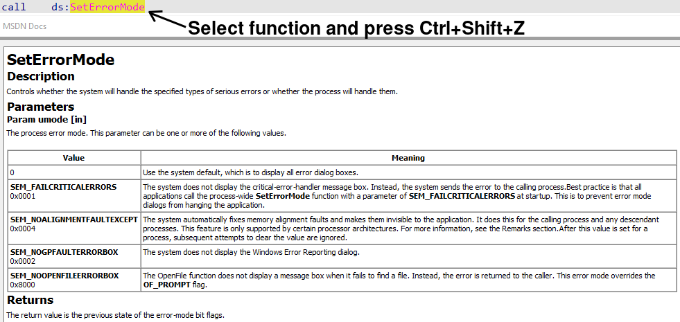

# msdocsviewer-ex

Remastered version of original [msdocsviewer by alexander-hanel](https://github.com/alexander-hanel/msdocsviewer)

`msdocsviewer-ex` is a simple tool for viewing Microsoft's win32 API and driver technical documentation **offline**.

To use just click or select function name and press **Ctrl+Shift+Z** hotkey

## Features

- Spellchecking and filtering of selected function name
- Autofocus for documentation widget
- No external python dependencies, ready-to-use in your VM
- Markdown description was cleared, table borders and other things added
- Built-in compressed one-file database
- Fast database building, usually takes less than minute (including download of repositories)

### Installation 

Copy content of `plugins/` directory to `%IDA_HOME%/plugins/`. No additional dependencies.

> In-memory database require about 17MB of memory, 
> if it's too much, set `USE_CACHE = False` in `msdocsviewer_ex.py`

### Build

Run `build.sh` script. If script succeed, file 'msdocsviewer_ex.db' will be created in working directory.

Documentation fetched from official [sdk-api](https://github.com/MicrosoftDocs/sdk-api) and [windows-driver-docs-ddi](https://github.com/MicrosoftDocs/windows-driver-docs-ddi) repositories.

Pre-built version already present in `plugins` folder (as long as it does not violate licensing rights of previously mentioned repositories...)